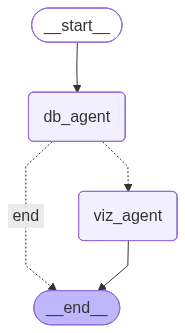

# Database Chat Agent

A Streamlit-based chat application that allows users to query a SQLite database using natural language. Powered by Google Gemini and LangGraph, it supports text and voice input, generates SQL queries automatically, and creates visualizations on demand.

## Features

- **Natural Language Queries**: Ask questions about your data in plain English or Portuguese
- **Voice Input**: Record audio questions using the built-in microphone widget
- **Automatic SQL Generation**: Uses LangGraph ReAct agent pattern to generate and execute SQL
- **Data Visualization**: Automatically generates matplotlib charts when requested
- **Query Transparency**: Expandable status panels show the SQL queries being executed
- **Bilingual Support**: Responds in the same language as the user's query

## Architecture

```
User Input (text/audio)
        |
        v
+------------------------+
|  Audio Transcription   |  <-- Gemini Multimodal (if voice input)
+------------------------+
        |
        v
+------------------------+
|       DB Agent         |  <-- ReAct pattern with SQLDatabaseToolkit
|   (SQL Generation)     |
+------------------------+
        |
        v
  [NEEDS_VISUALIZATION]?
        |
   yes /   \ no
      /     \
     v       v
+---------+  END
|Viz Agent|
+---------+
     |
     v
    END
```

### Components

| File | Description |
|------|-------------|
| `app.py` | Streamlit UI, chat interface, visualization rendering |
| `lib/agents.py` | LangGraph workflow with DB and Visualization agents |
| `lib/db_utils.py` | Database connection, LLM setup, SQLDatabaseToolkit |
| `lib/__init__.py` | Package exports |

## Database Schema

The application queries a SQLite database (`data/clientes_completo.db`) containing customer data:

| Table | Description | Key Columns |
|-------|-------------|-------------|
| `clientes` | Customer information | id, nome, email, idade, cidade, estado, profissao, genero |
| `compras` | Purchase records | id, cliente_id, data_compra, valor, categoria, canal |
| `campanhas_marketing` | Marketing campaigns | id, cliente_id, nome_campanha, data_envio, interagiu, canal |
| `suporte` | Support tickets | id, cliente_id, data_contato, tipo_contato, resolvido, canal |

## Installation

### Prerequisites

- Python 3.10+
- A Google Gemini API key

### Setup

1. Clone the repository:
   ```bash
   git clone https://github.com/guinacio/database-chat.git
   cd database-chat
   ```

2. Install dependencies (using [uv](https://github.com/astral-sh/uv)):
   ```bash
   uv venv
   uv sync
   ```

3. Configure your API key (choose one method):

   **Option A**: Create a `.env` file:
   ```
   GEMINI_API_KEY=your_api_key_here
   ```

   **Option B**: Enter the key in the sidebar when running the app

4. Ensure you have the database file:
   ```
   data/clientes_completo.db
   ```

## Usage

### Running the Application

```bash
uv run streamlit run app.py
```

The app will open at `http://localhost:8501`

### Example Queries

**Text Queries:**
- "List the first 5 customers"
- "How many purchases were made in each category?"
- "Show sales by category as a bar chart"
- "What's the average customer age by city?"
- "Quantos clientes existem por estado?"

**Voice Queries:**
Click the microphone icon and speak your question. The audio will be transcribed using Gemini's multimodal capabilities.

### Understanding the Status Panel

When a query is processed, an expandable status panel shows:
- The SQL queries executed
- Processing state (Analyzing -> Executing SQL -> Complete)

Click on "Query complete" to expand and view the SQL that was run.

## Technical Details

### LangGraph Workflow

The application uses a LangGraph StateGraph with two nodes:

1. **DB Agent Node**: Uses `create_react_agent` with SQLDatabaseToolkit tools
   - Explores database schema
   - Generates and validates SQL queries
   - Returns results with optional `[NEEDS_VISUALIZATION]` marker

2. **Visualization Agent Node**: Generates matplotlib code
   - Parses query results
   - Creates appropriate chart types
   - Returns executable Python code

### State Schema

```python
class AgentState(TypedDict):
    messages: Annotated[List[BaseMessage], operator.add]
    query_result: Optional[str]
    visualization_code: Optional[str]
    needs_visualization: bool
```

### Workflow Graph



### Visualization Execution

Generated matplotlib code runs in a restricted execution context with:
- Pre-imported: `pandas`, `matplotlib`, `numpy`
- Sandboxed builtins (no file I/O, no imports)
- Fixed figure size (10x6 inches)

## Configuration

### Environment Variables

| Variable | Description |
|----------|-------------|
| `GEMINI_API_KEY` | Google Gemini API key (primary) |
| `GOOGLE_API_KEY` | Alternative API key variable |

### Model

The application uses `gemini-3-flash-preview` for all LLM operations:
- Database queries (temperature: 0)
- Visualization generation (temperature: 0.2)
- Audio transcription

## Dependencies

```
streamlit==1.52.2
langchain-core
langchain-google-genai
langchain-community
langgraph
pandas
matplotlib
sqlalchemy
python-dotenv
```

## Troubleshooting

### Common Issues

**"GEMINI_API_KEY environment variable not set"**
- Ensure your `.env` file exists and contains the key
- Or enter the key in the sidebar

**"Error executing visualization"**
- The generated code may use unsupported functions
- Try rephrasing your visualization request

**Audio widget shows "An error has occurred"**
- This can happen after recording; the transcription still works
- The app automatically resets the widget for the next recording

### Debug Mode

To see the SQL queries being executed, expand the "Query complete" status panel after each response.

## License

MIT License
